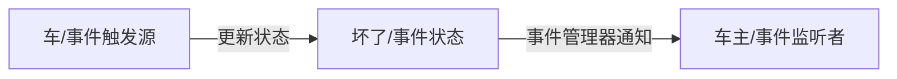

---
title: 谈一谈SpringBoot怎么使用事件机制
date: 2023-09-25 02:00:13
tags: springboot
categories: 
- java
---
## 观察者模式

> 对象之间定义了一对多的依赖，这样一来，当一个对象改变状态，依赖它的对象会收到通知并自动更新。观察者模式（Observer）又称发布-订阅模式（Publish-Subscribe：Pub/Sub）。它是一种通知机制，让发送通知的一方（被观察方）和接收通知的一方（观察者）能彼此分离，互不影响。

观察者模式主要由以下四个角色组成，分别是抽象主题角色、抽象观察者角色、具体主题角色、具体观察者角色。

### 抽象主题角色

​	把所有观察者对象的引用保存在一个集合中，每个抽象主题角色都可以有任意数量的观察者，抽象主题提供一个接口，可以增加和删除观察者角色，一般用一个抽象类或接口来实现。JDk内置实现的抽象主题角色Observable类。


### 具体主题角色

在具体主题内部状态改变时，给所有登记过的观察者发出通知，具体主题角色通常用一个子类实现。写一个类(具体主题角色)继承Observable（抽象主题角色），只需要写一个change方法即可 (该方法作用是通知已注册的具体主题角色更新自己)

```java
/**
 *  具体主题角色(被观察者)，在自身一些状态变更时通知观察者
 *  这里应用被人注册了，观察观察者
 * @author codehome
 *
 */
public class AppObservable extends Observable{
	public void registry(String userName) {
		setChanged();
		notifyObservers(userName);
	}

}
```


### 抽象观察者角色

为所有具体的观察者定义一个接口，在得到主题的通知时更新自己。JDK内置的Observer接口。


### 具体观察者角色

该角色实现抽象观察者角色所要求的更新接口，以便使本身的状态与主题的状态相协调，如果需要，具体观察者角色可以有一个指向具体主题角色的引用，通常用一个子类实现

```java
/**
 * 具体观察者，实现更新方法
 * @author codehome
 *
 */
public class AppWatcher implements Observer{
	@Override
	public void update(Observable o, Object arg) {
		if(o instanceof AppObservable) {
			System.out.println(o);
			System.out.println(arg);
		}
	
	}
}
```

### 使用举例

```java
public class SubPubDemo {
	public static void main(String[] args) {
		//主题角色，被观察者
		AppObservable appObservable=new AppObservable();
		//观察者
		AppWatcher appWatcher=new AppWatcher();
		//添加观察者
		appObservable.addObserver(appWatcher);
		//调用更新方法
		appObservable.registry("zhangsan");
	}
}
```

## 事件机制

> JDK 1.0及更早版本的事件模型基于职责链模式，但是这种模型不适用于复杂的系统，因此在JDK 1.1及以后的各个版本中，事件处理模型采用基于观察者模式的委派事件模型(DelegationEvent Model, DEM)，即一个Java组件所引发的事件并不由引发事件的对象自己来负责处理，而是委派给独立的事件处理对象负责。

事件机制一般需要3个角色，事件触发源(event source)、事件状态对象(event object)、事件监听者(event listener)。

### 事件状态对象

JDK内置的事件状态对象EventObject,持有事件触发源。

```java
public class EventObject implements java.io.Serializable {

    private static final long serialVersionUID = 5516075349620653480L;
	//事件触发源
    protected transient Object  source;
    public EventObject(Object source) {
        if (source == null)
            throw new IllegalArgumentException("null source");

        this.source = source;
    }

    public Object getSource() {
        return source;
    }
    public String toString() {
        return getClass().getName() + "[source=" + source + "]";
    }
}
```

### 事件监听者

JDK内置的事件监听接口

```java
public interface EventListener {
}
```

## Spring内置的事件发布订阅

上面介绍了观察者与发布者模式，与事件机制。举例总结来说如下图：



### ApplicationEvent

ApplicationEvent实现了JDK的EventObject接口，为事件状态，持有事件触发源。


### ApplicationListener

ApplicationListener实现了JDK的Eventlistener接口，为事件监听者接口。


### ApplicationEventMulticaster

ApplicationEventMulticaster为事件监听者与事件状态的管理接口，管理事件状态与监听器的关系。


## SpringBoot如何使用事件发布订阅机制

```java
//继承ApplicationEvent接口，定义一个事件状态
public class AppStatusEvent extends ApplicationEvent {
    /**
     * Create a new ApplicationEvent.
     *
     * @param source the object on which the event initially occurred (never {@code null})
     */
    AppDO appDO;
    public AppStatusEvent(Object source,AppDO appDO) {
        super(source);
        this.appDO=appDO;
    }

    public AppDO getAppDO() {
        return appDO;
    }
}
```

````java
//监听对应事件的事件监听器
@Component
@Slf4j
public class AppStatusListener {
    @EventListener
    @Async
    public void onApplicationEvent(AppStatusEvent event){
        AppDO appDO=event.getAppDO();
        if(AuthUtil.commomCheck(appDO)){
            log.info("{}被禁用,开始关闭与imf系统的收发",appDO.getAppName());
            SessionUtil.forbidden(appDO.getAppCode());
        }

    }
}
````

```java
//发布事件
@Autowired
ApplicationEventPublisher eventPublisher;
eventPublisher.publishEvent(new AppStatusEvent(this,app));
```

**千里之行，始于足下。这里是SpringBoot教程系列关于spring的事件机制，本教程所有项目源码均可以在我的[GitHub](https://github.com/mytianya/springboot-tutorials "GitHub")上面下载源码。**